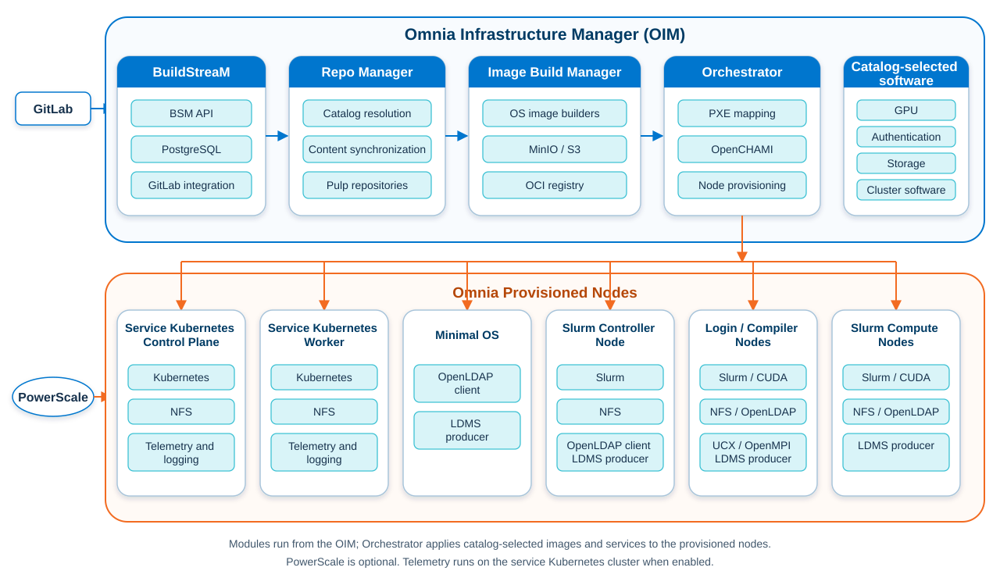

# Architecture

## Modular deployment architecture

Omnia runs from an Omnia Infrastructure Manager (OIM). The OIM hosts the
shared Python virtual environment, project input and output directories, module
logs, and the services deployed by the selected modules.

Omnia separates deployment responsibilities into seven capability-based
deployment modules. Each module has a top-level Ansible playbook at
`src/<domain>/playbooks/<domain>.yml` and a `domain-init.sh` script that
installs its declared dependencies and stages its input templates. In these
implementation paths, `<domain>` is the module's internal identifier. The
`src/main/omnia.sh` script initializes the modules and invokes one module
playbook at a time. `main` is the common controller and is not an eighth module.



## Deployment module responsibilities

| Deployment module | Responsibility | Primary customer-facing output or service |
|---|---|---|
| `repo_manager` | Deploy an HTTPS Pulp service and synchronize catalog-selected RPM, container, Python, and file content. | `repo_status.yml` and the Pulp distributions it describes |
| `image_build_manager` | Deploy MinIO and a local registry when selected, then build OS images for catalog or configured functional groups. | `build_status.yml` and image artifacts in S3 and the registry |
| `discovery` | Query OpenManage Enterprise for BMC inventory and generate an Orchestrator-compatible mapping. | `bmc_pxe_mapping_file.csv` and `bmc_discovery_report.csv` |
| `orchestrator` | Deploy OpenCHAMI and catalog-selected OpenLDAP, register mapped nodes, create boot and cloud-init configuration, configure Slurm or service Kubernetes, and optionally initiate iDRAC PXE boot. | `orchestrator_status.yml`, `orchestrator_inventory.yaml`, provisioning reports, and the deployed clusters |
| `telemetry` | Deploy the enabled telemetry sources, bridges, Kafka, VictoriaMetrics, and VictoriaLogs on a service Kubernetes cluster. | `telemetry_status.yml`, Kubernetes workloads, and optional external connection exports |
| `build_stream` | Deploy PostgreSQL, Build Stream Manager, the playbook watcher, GitLab integration, and the managed CI/CD project and runner. | `build_stream_status.yml`, the BSM API, and GitLab pipelines |
| `utils` | Run independent operational utilities, including log collection and unattended OS installation. | `utils_status.yml` and operation-specific results |

Modules can be invoked separately, but downstream workflows require the
contracts produced upstream. Discovery is optional when the administrator
provides a valid PXE mapping. Telemetry is optional and requires service
Kubernetes. Utils runs only when its operation is needed.

## Execution and contract flow

The direct deployment flow implemented by `omnia.sh` is:

```text
omnia.sh setup
      |
      v
repo_manager  -- repo_status.yml --> image_build_manager
                                          |
                                          +-- build_status.yml --+
                                                               |
discovery -- bmc_pxe_mapping_file.csv --+                     |
                                         v                     v
                                      orchestrator <------------+
                                         |
                                         +-- orchestrator_inventory.yaml
                                         +-- bmc_group_data.csv
                                         +-- provisioned Slurm/Kubernetes
                                                        |
                                                        v
                                                    telemetry

utils: invoked independently for a selected operational task
build_stream: alternate automation path for build and deploy pipelines
```

The principal handoffs are:

| Producer | Consumer | Contract |
|---|---|---|
| Repository Manager | Image Build Manager and Orchestrator | `repo_status.yml` |
| Image Build Manager | Orchestrator | `build_status.yml` |
| Discovery or administrator | Orchestrator | `pxe_mapping_file.csv` |
| Orchestrator | Telemetry | `orchestrator_inventory.yaml` and, for iDRAC, `bmc_group_data.csv` |
| Catalog | Repository Manager, Image Build Manager, and Orchestrator | JSON functional layers, groups, packages, and sources |
| GitLab pipelines | Build Stream Manager | Uploaded catalog and module input files plus API job requests |

Contracts are not limited to YAML. Omnia uses YAML configuration and status
files, JSON catalogs and job data, and CSV mappings and reports.

## Runtime layout

`omnia.sh --setup-venv` installs the shared environment, runs the selected
modules' initialization scripts, and stages flat source inputs into a runtime
project layout. With the supplied defaults, that layout is:

```text
/opt/omnia/
├── venv/
├── .data/
├── catalog/
└── <domain>/
    ├── input/project_default/
    ├── output/project_default/
    └── log/project_default/
```

The actual root and project are controlled by `OMNIA_DATA_PATH` and
`OMNIA_PROJECT_NAME`. Component-specific data-path variables can override the
default module directories. Build Stream currently fixes its entry-playbook
input and output project to `project_default`.

## OIM and managed services

The OIM is the execution point for module playbooks and hosts services selected
by the deployment:

| Owner | Services or resources |
|---|---|
| Repository Manager | Pulp and its HTTPS content endpoints |
| Image Build Manager | MinIO S3 storage and a local OCI registry |
| Orchestrator | OpenCHAMI services, CoreDHCP, coresmd/CoreDNS, and optional OpenLDAP |
| Build Stream | PostgreSQL, the BSM API, and the playbook watcher; GitLab and its runner are deployed on the configured GitLab host |
| Telemetry | Kubernetes workloads on the service cluster, rather than an OIM-wide telemetry container |

Node operating-system images, hostnames, network data, and functional groups
are selected through the catalog and PXE mapping and are applied by
Orchestrator through OpenCHAMI boot parameters and cloud-init.

## Network relationships

Omnia distinguishes several network purposes:

- The **admin network** connects the OIM and managed nodes and carries content,
  provisioning, SSH, and cluster-management traffic.
- The optional **BMC network** provides out-of-band access to iDRAC for
  discovery, inventory, Telemetry, unattended installation, and PXE-boot
  control when those features are selected.
- The optional **InfiniBand network** provides the high-performance fabric for
  supported Slurm and storage workloads.
- Service Kubernetes pod and service networks are configured separately and
  must not overlap the management networks used by the deployment.

See [Network Topologies](network_topologies.md) for the supported layouts and
[Orchestrator configuration](../Reference/Configuration/orchestrator_config.md)
for the source-backed input fields.

## Kubernetes stack


Orchestrator provisions service Kubernetes only when the catalog and
`omnia_config.yml` select the service Kubernetes functional groups. The source
configures CRI-O storage for these nodes. Telemetry subsequently uses the
generated Orchestrator inventory and Kubernetes control-plane virtual IP to
deploy its selected workloads.

## Slurm stack


Orchestrator provisions the Slurm control, compute, login, and login-compiler
functional groups selected by the catalog and mapping. It configures the
applicable shared storage, Slurm services, authentication, optional GPU and
fabric software, and generated inventory. LDMS Telemetry additionally requires
reachable Slurm control and compute nodes.

## Related documentation

- [Running Deployment Modules](domain_execution.md)
- [Module Contracts](../Reference/index.md#module-contracts)
- [Get Started](../GetStarted/index.md)
- [How-to Guides](../HowTo/index.md)
